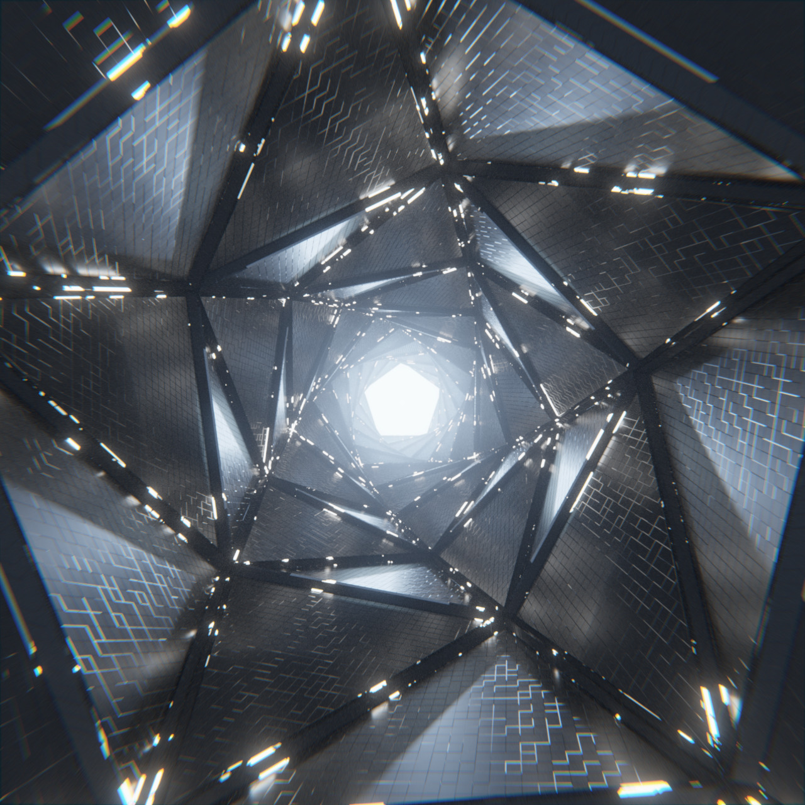
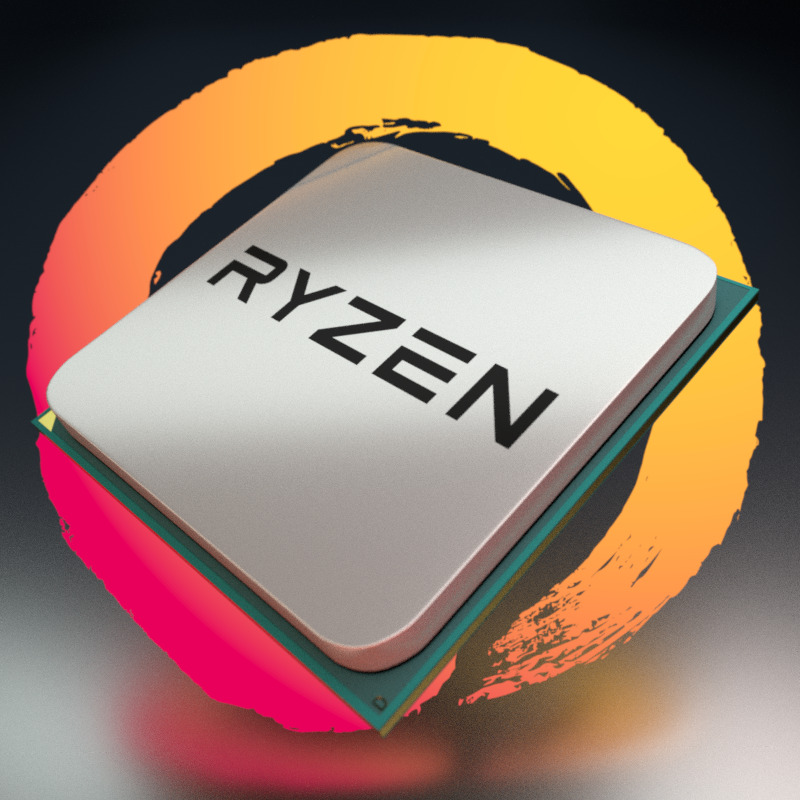

# App-Blender

Website - https://www.blender.org/

## Overview

Blender is the free and open source 3D creation suite.
It supports the entirety of the 3D pipeline—modeling, rigging, animation,
simulation, rendering, compositing and motion tracking, video editing and 2D animation pipeline.

## Options

* Blender Interactive
    * A GUI session of blender
* Benchmark
    * Runs a render session and records the time to finish the render
    * Can select to render using CPU, GPU, and CPU+GPU
    * Can select the number of GPUs to use
    * Current Benchmarking Renders
        * [Aperture](https://cloud.blender.org/p/gallery/5891c75149932b00185a03f1) (File from Midge "Mantissa" Sinnaeve)
            * GPU benchmark
        * [RyzenGraphic_27](http://download.amd.com/demo/RyzenGraphic_27.blend) (File from AMD)
            * CPU benchmark released by AMD for the zen cpu release
    * Current Options
        * `-renderFile` - One of the above images to render
        * `-enableCPU` - Allows th CPU to be used for the render
        * `-disableGPU` - Disables the GPU allowing only CPU benchmarks
        to be ran
        * `-maxNumGpu` - (Optional) Sets the max number of GPUs to be used

## Images

### Aperture

### RyzenGraphic_27

