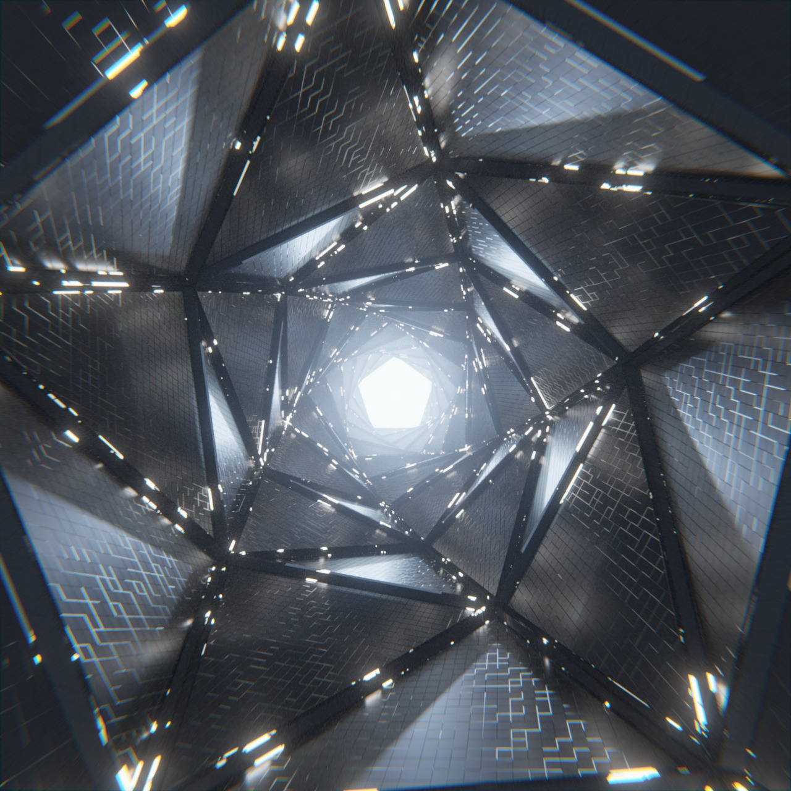
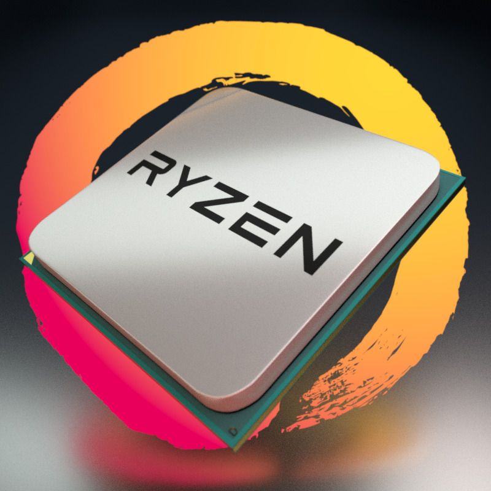

# App-Blender

Website - https://www.blender.org/

## Overview

Blender is the free and open source 3D creation suite.
It supports the entirety of the 3D pipeline—modeling, rigging, animation,
simulation, rendering, compositing and motion tracking, video editing and 2D animation pipeline.

## How to Build

Blender is fairly a simple app to build for release to jarvice.
Main steps include:
- Update `Makefile` with the blender version you would like to build. As an example, if you want Blender version 5.2.2:
    ```Makefile
    MAJOR_MINOR=5.2
    PATCH_VERSION=2
    ```
- To build, run `make release` to build the app on rocky linux 9
- Test the application by running `./verify`
    - If port 5902 is taken, you can run `./verify 5903` to use a port 5903
    - Initially, the verification script will run two benchmarks, one without GPU and one with GPU.
    - Open a web portal to `127.0.0.1:PORT/vnc.html` where PORT is the port number used with verify
    - You are now able to use the GUI.
    - Note: No GPU will be passed for GPU acceleration.
- Once happy with the build, run `make push-release` to push the app image to the artifact registry.
- Once pushed, you will now be able to either update the latest blender image (5.2.1 -> 5.2.2) or add a new blender app if the major release has been updated.

## Options

* Blender Interactive
    * A GUI session of blender
* Benchmark
    * Runs a render session and records the time to finish the render
    * Can select to render using CPU, GPU, and CPU+GPU
    * Can select the number of GPUs to use
    * Current Benchmarking Renders
        * [Aperture](https://cloud.blender.org/p/gallery/5891c75149932b00185a03f1) (File from Midge "Mantissa" Sinnaeve)
            * GPU benchmark
        * [RyzenGraphic_27](http://download.amd.com/demo/RyzenGraphic_27.blend) (File from AMD)
            * CPU benchmark released by AMD for the zen cpu release
    * Current Options
        * `-renderFile` - One of the above images to render
        * `-enableCPU` - Allows th CPU to be used for the render
        * `-disableGPU` - Disables the GPU allowing only CPU benchmarks
        to be ran

## Images

### Aperture




### RyzenGraphic_27


